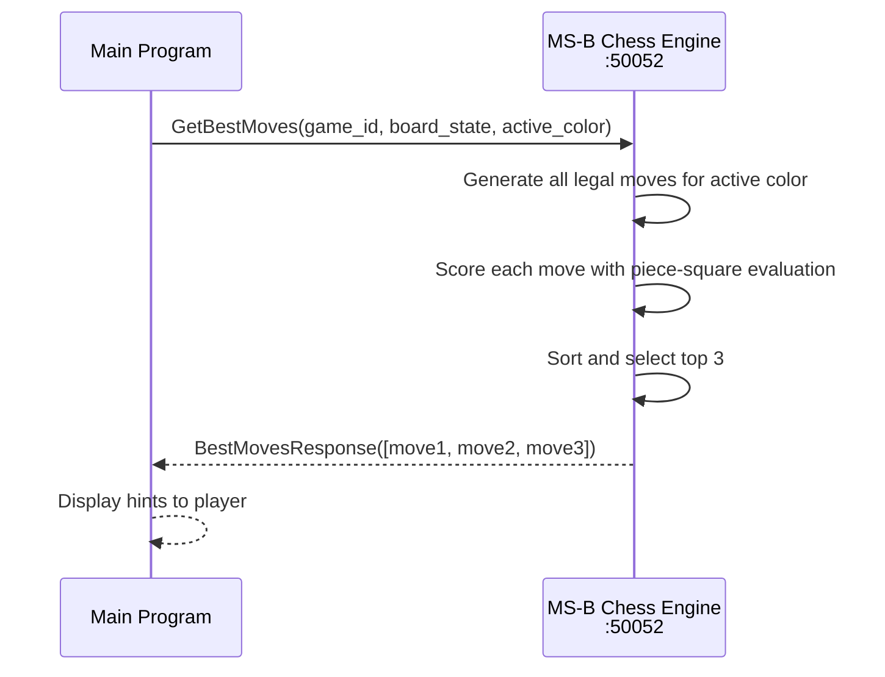

# Microservice B — Chess Engine
**CS 361 | Port 50052 | gRPC**

Returns the top 3 best moves for the active player using piece-square table evaluation.

---

## Setup

```bash
pip install grpcio grpcio-tools
python3 server.py
```

---

## Request

```python
import grpc, json, engine_pb2, engine_pb2_grpc

stub = engine_pb2_grpc.ChessEngineStub(grpc.insecure_channel("localhost:50052"))

response = stub.GetBestMoves(engine_pb2.BestMovesRequest(
    game_id      = "game_001",
    board_state  = json.dumps(board),  # dict {square: "COLOR_PIECE"}
    active_color = "WHITE",            # "WHITE" or "BLACK"
))
```

## Response

```python
for move in response.moves:
    move.rank            # 1 = best, 2, 3
    move.piece_position  # e.g. "E2"
    move.target_position # e.g. "E4"
    move.score           # centipawn evaluation
    move.reasoning       # e.g. "Controls the center"
```

---

## UML Sequence Diagram


